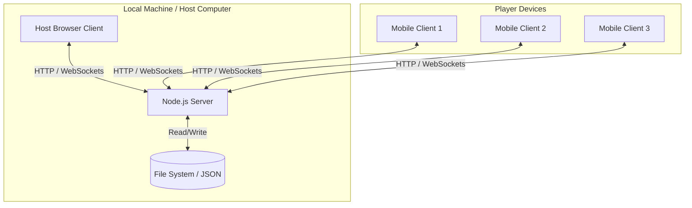
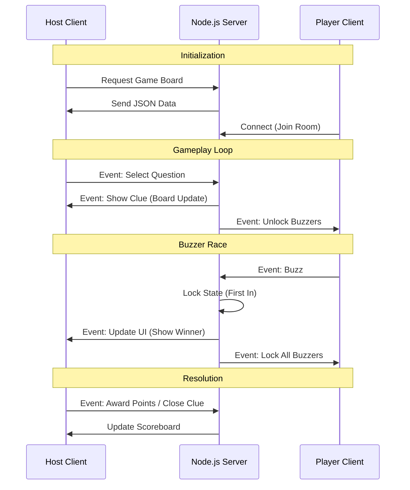

# GIT-MONEY-JEOPARDY System Design

## Architecture Overview

The system follows a client-server architecture using a local Node.js server to facilitate real-time communication between the Host (Game Board) and Players (Mobile Buzzers).

### System Components



## Data Flow: Game State Synchronization

The server maintains the authoritative state of the game. State changes propagate to all connected clients via Socket.io events.



## Component Responsibilities

### Backend (Node.js + Express + Socket.io)
- **Static File Serving**: Delivers HTML/CSS/JS assets to clients.
- **State Management**: Tracks current active question, buzzer status (locked/open), and player connection status.
- **Persistence**: Handles file I/O operations to read/write game configurations to `games.json`.

### Host Client (Browser)
- **Presentation Layer**: Renders the Jeopardy grid using CSS Grid.
- **Game Logic Controller**: Initiates game phases (reveal clue, start timer, award points).
- **Editor Module**: Provides an interface to modify game data and triggers persistence requests to the server.

### Player Client (Mobile Browser)
- **Input Interface**: Simple, low-latency interface for buzzing.
- **Feedback Display**: Visual indicators for "Locked", "Open", and "Win/Lose" states based on server signals.

## Data Structure

The game data is stored in a JSON format.

```json
{
  "categories": [
    {
      "name": "Category Name",
      "questions": [
        {
          "value": 200,
          "question": "Clue text",
          "answer": "Answer text",
          "dailyDouble": false
        }
      ]
    }
  ]
}
```
