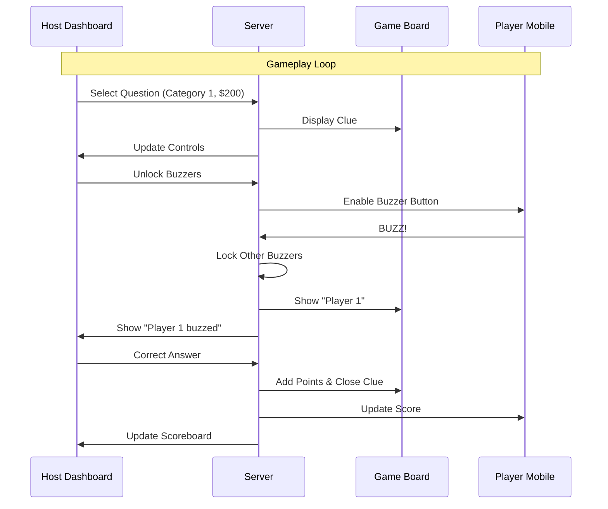

# Git Money Jeopardy

A full-stack web application that brings the Jeopardy! game show experience to your living room or office. It features a real-time game board, a dedicated host control dashboard, and mobile-friendly buzzer interfaces for players.

## Architecture Overview

The system is built as a **monorepo-style** project with two main directories:

- **`client/`**: The frontend application built with React and Vite. It serves all user interfaces (Host, Player, Game Board).
- **`server/`**: The backend Node.js application that manages game state, WebSocket connections, and data persistence.

### System Components

```mermaid
graph TD
    subgraph Local_Network [Local Network]
        Server[Node.js Server <br/> (Port 3001)]
        Storage[(games.json)]
        
        subgraph Frontend_Clients [React Clients <br/> (Port 5173)]
            HostControl[Host Dashboard]
            GameBoard[Main Game Board]
            Player1[Player Mobile 1]
            Player2[Player Mobile 2]
        end
    end

    HostControl <-->|"Socket.io Events"| Server
    GameBoard <-->|"Socket.io Events"| Server
    Player1 <-->|"Socket.io Events"| Server
    Player2 <-->|"Socket.io Events"| Server
    Server <-->|"Read/Write"| Storage
```

## Tech Stack

### Client (`/client`)
- **Framework**: React 19 + TypeScript
- **Build Tool**: Vite
- **Styling**: Tailwind CSS v4
- **Routing**: React Router v7
- **Communication**: Socket.io Client
- **Features**:
  - **Host Dashboard**: Protected route for game control (unlocking buzzers, awarding points).
  - **Game Board**: The big screen display showing categories and clues.
  - **Player View**: Mobile-optimized buzzer button.
  - **Editor**: Interface to create and modify game boards.

### Server (`/server`)
- **Runtime**: Node.js
- **Framework**: Express
- **Real-time**: Socket.io
- **Data Storage**: Local JSON file (`games.json`)
- **Features**:
  - Manages active game state (current question, buzzer locks, scores).
  - Broadcasts state changes to all connected clients.
  - Persists game boards and edits to disk.

## Getting Started

### Prerequisites
- Node.js (v18 or higher recommended)
- npm or yarn

### 1. Start the Server
The server handles all game logic and data storage.

```bash
cd server
npm install
node index.js
```
*The server will start on port `3001`.*

### 2. Start the Client
The client provides the UI for the host, board, and players.

```bash
cd client
npm install
npm run dev
```
*The client will usually start on port `5173`.*

> **Note**: To play with others on the same Wi-Fi network, ensure your computer's firewall allows incoming connections on ports 3001 and 5173. The client runs with `vite --host` to expose it to the network.

## How to Play

1. **Host**: Open the client URL (e.g., `http://localhost:5173/host`) to log in and access the **Dashboard**.
2. **Main Screen**: Open `http://localhost:5173/board` on a TV or large monitor. This is what the players see.
3. **Players**: Players scan a QR code (provided on the Splash screen or Board) or navigate to `http://<YOUR_IP>:5173/play` on their phones.
4. **Game Flow**:
   - Host selects a clue on the Dashboard.
   - Question appears on the Board.
   - Host "Unlocks Buzzers".
   - Players race to press their buzzer.
   - First player's name flashes on the Board.
   - Host marks answer Correct or Wrong.

## Data Structure

Game boards are stored in `server/games.json`. You can edit them via the `/editor` route in the application or by manually modifying the JSON file (server restart required for manual edits).

```json
{
  "activeBoardId": "uuid-string",
  "boards": {
    "uuid-string": {
      "name": "My Custom Game",
      "data": {
        "categories": [
          {
            "name": "Tech Trivia",
            "questions": [
              {
                "value": 200,
                "question": "This language powers the web.",
                "answer": "What is JavaScript?"
              }
            ]
          }
        ]
      }
    }
  }
}
```

## Game Logic Diagram


